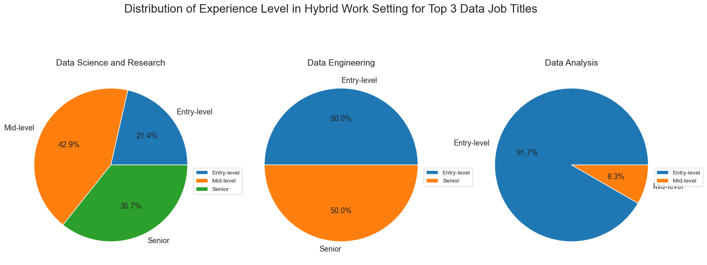
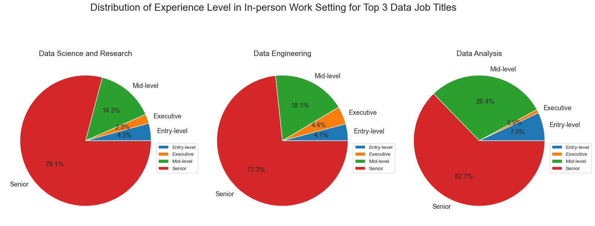

# README

## Introduction
The U.S. Bureau of Labor Statistics projects a 36% growth in employment for data scientists between 2023 and 2033. This is not surprising at all. Ever since the pandemic started, hybrid/remote work settings became the preference for the job seekers due to its convenience and safety concerns. Due to this, the number of job posting for data roles skyrocketed.

This analysis aims to help job seekers to enter the industry by providing insight about the employments for the top 3 data job categories based on the various factors such as:

    1.) Work setting
    2.) Experience level`

For the analysis, we'll be using the jobs_in_data dataset gathered from Kaggle:
    
   [https://www.kaggle.com/datasets/hummaamqaasim/jobs-in-data/data]()

## Data Preprocessing
First, we'll import the necesary libraries that we'll be using in the analysis.

```python
import pandas as pd
import matplotlib.pyplot as plt
import seaborn as sns
```
Next, we'll load the dataset that we'll be using and print the first five rows. We'll be limiting our analysis for the companies located in the United States.

```python
#Load the dataset
df = pd.read_csv('jobs_in_data.csv')

#For this analysis, we consider only companies located in the United States.
df_US = df[df['company_location'] == 'United States']
df_US.head()
```


Getting initial insights in our dataset.

```python
#Getting initial insights in our data.
df_US.info()
```

    <class 'pandas.core.frame.DataFrame'>
    Index: 8132 entries, 1 to 9354
    Data columns (total 12 columns):
    #   Column              Non-Null Count  Dtype 
    ---  ------              --------------  ----- 
    0   work_year           8132 non-null   int64 
    1   job_title           8132 non-null   object
    2   job_category        8132 non-null   object
    3   salary_currency     8132 non-null   object
    4   salary              8132 non-null   int64 
    5   salary_in_usd       8132 non-null   int64 
    6   employee_residence  8132 non-null   object
    7   experience_level    8132 non-null   object
    8   employment_type     8132 non-null   object
    9   work_setting        8132 non-null   object
    10  company_location    8132 non-null   object
    11  company_size        8132 non-null   object
    dtypes: int64(3), object(9)
    memory usage: 825.9+ KB

Fortunately, our dataset's already clean and has no missing values. Hence, we can now start the analysis.

# The Analysis
As stated earlier, this analysis is for the top 3 data job categories in the United States. So, we'll start our analysis by identifying this.

```python
#Get the top 3 data job categories in the United States
df_US['job_category'].value_counts().head(3)

#Save the top 3 data job categories to a variable
top_3_job = df_US['job_category'].value_counts().head(3).index.to_list()
top_3_job
```
    job_category
    Data Science and Research    2635
    Data Engineering             1977
    Data Analysis                1252
    Name: count, dtype: int64

For the detailed steps of every plots/graphs shown, please see my notebook here: [Step by Step Analysis Notebook](notebook.ipynb)

## 1.) Mean salary of the Top 3 Data Job Categories on Different Work Settings

Ever since the pandemic, most applicants heavily consider the work setting in accepting the job offers. Here, we will explore how well the different job categories paid based on different work settings.

To find the mean salary of top 3 data job categories, I filtered the 'job_category' column to the said categories, then utilized pandas groupby to finally calculate for the mean salary.

### Visualize the Data
```python
fig, ax = plt.subplots(3,1)
sns.set_style(style='ticks')
for i,job in enumerate(top_3_job):
    mean_work_setting_plot = mean_work_setting[mean_work_setting['job_category'] == job]
    sns.barplot(data=mean_work_setting_plot, y='work_setting', x='mean_salary', legend=False, ax=ax[i], palette='Set2', hue='mean_salary')
    ax[i].set_ylabel('')
    ax[i].set_xlim(0,200000)
    ax[i].set_xlabel('')
    ax[i].set_title(job)
    ax[i].xaxis.set_major_formatter(plt.FuncFormatter(lambda x,pos: f'${int(x/1000)}K'))
plt.suptitle('Mean Salary of Top 3 Data Jobs Based on Work Setting in the United States')
plt.tight_layout()
plt.show()
```


### Insights
- Data Science and Research category has the highest mean salary than the others, with In-person work setting having the mean salary around $175K, followed by Remote and Hybrid work setting which are both slightly lower.
- Among the job categories, Data Engineering pays remote work setting the most than other work settings.
- Data Analysis has the lowest mean salary among the categories, across all work settings.
- Hybrid work setting has the lowest mean salary across different job categories.

### Deep dive on to what causing why Hybrid work setting mean salary to be the lowest  
Many job seekers prefer Hybrid work setting due to its convenience and cost-efficiency. We'll dive deeper on to the reason why Hybrid work setting has the lowest mean salary in all data job categories.

We'll compute the distribution of the experience level in the top 3 data job categories for every work settings. (For detailed steps, please look at the notebook [using this link](notebook.ipynb).

### Visualize the data
```python
df_US_distribution = df_US_top3.groupby(['job_category', 'work_setting', 'experience_level'],dropna=False).size()
df_US_distribution = df_US_distribution.reset_index(name='job_count')
df_US_distribution = df_US_distribution[df_US_distribution['job_category'].isin(top_3_job)]
setting_work = ['Hybrid', 'In-person', 'Remote']
for work in setting_work:
    df_US_dist_plot = df_US_distribution[df_US_distribution['work_setting'] == work]
    df_US_dist_plot = df_US_dist_plot.set_index('job_category')

    fig,ax = plt.subplots(1,3, figsize=(20,15))
    for i,job in enumerate(top_3_job):
        ax[i].pie(data=df_US_dist_plot.loc[job], x='job_count', labels=df_US_dist_plot.loc[job]['experience_level'], autopct='%1.1f%%', textprops={'fontsize': 13})
        ax[i].set_title(job, fontsize=15)
        ax[i].legend(loc='upper right', bbox_to_anchor=(1.2,0.5))
    plt.suptitle(f'Distribution of Experience Level in {work} Work Setting for Top 3 Data Job Titles', y=0.75, fontsize=20)
```




### Insights
- Hybrid work setting is dominated by lower level experiences, especially the Data Analysis category.
    - This causes the mean average to be low since low experience level tends to imply lower salary.
    - Data analysis is more of an entry-level category than the other two.
- Both In-person and Remote work setting dominated by senior level experience level.
    - Companies tend to offer this work setting to tenured employees due to their expertise in the field. They do not need much of a guidance from their higher-ups. If anything, they are the one to mentor their entry-level employees.
    - Though, some companies offer trainings before transitioning employees to Hybrid work setting.

## 2.) Mean salary for top 3 data job categories based on experience level

Some applicants care not much about the work setting. In this case, they might want to consider how well different job categories pay based on experience level.

To find the mean salary of top 3 data job categories, I filtered the 'job_category' column to the said categories, then utilized pandas groupby to finally calculate for the mean salary for different experience levels.

For detailed steps, please check my notebook [using this link](notebook.ipynb).


### Visualize the data
```python
fig, ax = plt.subplots(3,1)
sns.set_style(style='ticks')
for i,job in enumerate(top_3_job):
    mean_exp_level_plot = mean_exp_level[mean_exp_level['job_category'] == job]
    sns.barplot(data=mean_exp_level_plot, y='experience_level', x='mean_salary', legend=False, ax=ax[i], palette='Set2', hue='mean_salary')
    ax[i].set_ylabel('')
    ax[i].set_xlim(0,225000)
    ax[i].set_xlabel('')
    ax[i].set_title(job)
    ax[i].xaxis.set_major_formatter(plt.FuncFormatter(lambda x,pos: f'${int(x/1000)}K'))
plt.suptitle('Average Salary of Top 3 Data Job Categories Based on Experience Level')
plt.tight_layout()
plt.show()
```


### Insights
- Data Science and Research category leads the mean salary on every experience level.
    - This is expected since Entry-level positions in this category are not exactly "Entry-level". For example, Data Scientist is not really an entry-level position, but it is entry-level in this category.
- Data Analysis category has the lowest mean salary in every experience level.
    - Weirdly enough, the Senior level has higher mean salary compare to Executive level.
    - Some articles suggest that there are senior level role in this category that assumes the Executive's responsibility. This might cause for some Senior level to be on par or even higher with Executive level in salary.
- Data Analysis category has also lowest salary growth.
    - Job seekers currently in this category might want to consider shifting into different category as salary progression is much higher.

## Are these categories paid well?
While all the shown graphs reflect the average salary, sometimes they do not reflect the whole picture. Here, we'll explore how well the top 3 data job categories paid based on experience level.

For detailed steps, please check my notebook [using this link](notebook.ipynb).

### Visualize the data
```python
experience = ['Entry-level', 'Mid-level', 'Senior', 'Executive']
sns.set_style('ticks')
for job in top_3_job:
    df_US_DA = df_US_top3[df_US_top3['job_category'] == job]
    DA_list = [df_US_DA[df_US_DA['experience_level'] == exp]['salary_in_usd'] for exp in experience]
    plt.boxplot(DA_list, tick_labels=experience, vert=False)
    plt.title(f'Salary Distribution of {job} in the United States')
    ax = plt.gca()
    ax.xaxis.set_major_formatter(plt.FuncFormatter(lambda x,pos: f'${int(x/1000)}K'))
    plt.show()
```


### Insight
- Data Science and Research
    - There is no extreme low points which indicates that nothing in any experience level is underpaid. Hence, every experience level are paid well.
    - The Executive role has the highest median salary, slightly above Senior level.
    - Some Senior level roles have higher outlier than the Executive role, this might indicate some kind of specialist role in the field.
    - Some Mid-level role paid significantly higher than Senior-level role. This might indicate title may not fully reflect the responsibilities.
    - Both Entry-level and Mid-level shows low distribution that might indicate standardized pay.

- Data Engineering
    - Every experience level is paid well, with the exception of Senior level as some in this level is paid incredibly low.
    - As expected, Executive level has the highest median salary, but unlike in Data Science and Research category, it has no outliers.
    - Senior-level role, despite having extremely low outlier, has the most outlier that exceeds the pay of Executive-level roles.
    - Mid-level role has the most balance dsitribution of salary with some outliers in the higher extremity.
    - Entry-level role median pay is very low, but the salary distribution seems to be skewed to the higher end.

- Data Analysis
    - There is no extreme low points which indicates that nothing in any experience level is underpaid. Hence, every experience level are paid well.
    - The boxes across different experience level with exception of Executive-level are compact. This might indicate standardized pay.
    - Executive-level role has only slightly higher median salary compare to senior-level role.
    - Many of the Senior-level role is paid significantly higher than Executive-level role. This might indicate that the title may not fully reflect the responsibilities.
    - Some Mid-level role outlier is higher than the Senior-level role, more likely to reflect some kind of specialty in the field.
    - Entry-level role are paid the lowest and has the most compact distribution, too.